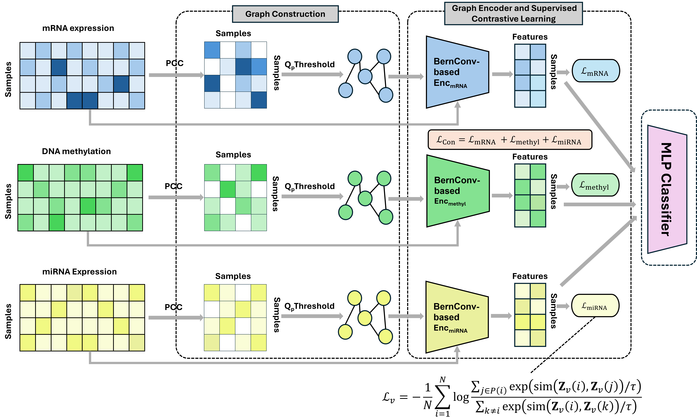

# P-SGCL

P-SGCL performs cancer-subtype classification from gene expression, DNA methylation, and miRNA data.



## Setup

P-SGCL is verified with Python 3.11. Install a CPU or CUDA build of PyTorch
that matches your system before installing the remaining dependencies.

Clone the repository into a directory named `P-SGCL`:

```bash
git clone https://github.com/anhnqak57/P-SGCL.git P-SGCL
cd P-SGCL
```

Create and activate a virtual environment.

macOS/Linux:

```bash
python3.11 -m venv .venv
source .venv/bin/activate
```

Windows PowerShell:

```powershell
py -3.11 -m venv .venv
.\.venv\Scripts\Activate.ps1
```

Then install the dependencies:

```bash
python -m pip install --upgrade pip
python -m pip install torch==2.5.1 --index-url https://download.pytorch.org/whl/cpu
python -m pip install -r requirements.txt
```

For CUDA, replace the CPU PyTorch installation command with the command from
[PyTorch's installation selector](https://pytorch.org/get-started/locally/).
To update an existing checkout, run `git pull --ff-only` from `P-SGCL/`.

## Repository structure

```text
P-SGCL/
├── run.py                    # central CLI for P-SGCL, MCRGCN, and central ablations
├── build_graphs.py           # creates adaptive-percentile graphs
├── requirements.txt          # training and evaluation dependencies
├── psgcl_core/               # data loading, preprocessing, runner, metrics, and CLI
├── models/                   # P-SGCL and graph encoders
├── baselines/                # MCRGCN, MOGONET, and MCGNN
├── ablations/                # without-contrastive and psgcl-mcrgcn-graph
├── analysis/brca/            # optional BRCA gene selection and enrichment
└── dataset/                  # source MAT files and edge lists for each dataset
```

## Data and quick start

The supplied datasets are under `dataset/`. Central models support `brca`, `brca-v5`, `gbm`, and `lgg`; MOGONET and MCGNN support `BRCA`, `GBM`, and `LGG`.

Validate the LGG inputs before training:

```bash
python run.py inspect-data --dataset lgg --data-dir dataset
```

Run P-SGCL on LGG:

```bash
python run.py train \
  --model psgcl \
  --dataset lgg \
  --run-name psgcl_lgg_full
```

Each run name must be new; existing experiment outputs are not overwritten.

## Models

### P-SGCL

```bash
python run.py train --model psgcl --dataset lgg --run-name psgcl_lgg_full
```

### Baselines

#### MCRGCN

```bash
python run.py train --model mcrgcn --dataset gbm --run-name mcrgcn_gbm_full
```

MCRGCN uses the supplied percentile graphs by default. To compare it with the
supplied MCRGCN graphs on BRCA or GBM, set `--graph-source legacy-mcrgcn`:

```bash
python run.py train --model mcrgcn --dataset brca --graph-source percentile --run-name mcrgcn_brca_percentile
python run.py train --model mcrgcn --dataset brca --graph-source legacy-mcrgcn --run-name mcrgcn_brca_legacy
python run.py train --model mcrgcn --dataset gbm --graph-source percentile --run-name mcrgcn_gbm_percentile
python run.py train --model mcrgcn --dataset gbm --graph-source legacy-mcrgcn --run-name mcrgcn_gbm_legacy
```

#### MOGONET

```bash
python -m baselines.mogonet \
  --dataset LGG --data-dir dataset \
  --output-dir outputs/mogonet --run-name mogonet_lgg_full
```

#### MCGNN

```bash
python -m baselines.mcgnn \
  --dataset LGG --data-dir dataset \
  --output-dir outputs/mcgnn --run-name mcgnn_lgg_full
```

### Ablations

```bash
python -m ablations.without_contrastive \
  --config ablations/configs/without_contrastive_gbm.json \
  --run-name without_contrastive_gbm_full

python -m ablations.psgcl_mcrgcn_graph \
  --config ablations/configs/psgcl_mcrgcn_graph_gbm.json \
  --run-name psgcl_mcrgcn_graph_gbm_full
```

`psgcl-mcrgcn-graph` is available only for the four-class BRCA and GBM datasets.

## Outputs and logs

Central runs write to:

```text
outputs/<dataset>/<model>/<run-name>/
├── config.json
├── metrics.json
├── training.log
├── seed_logs/
│   └── seed_<seed>.log
└── checkpoints/
```

Each fold is printed to the terminal. All folds for a seed are appended to `seed_logs/seed_<seed>.log`, followed by that seed's mean and standard deviation. `training.log` ends with the mean and standard deviation across seed means. MOGONET and MCGNN use the same per-seed log layout.

The `.pt` checkpoints and `.pkl` classifier sidecars are required to reload contrastive-model evaluations; use the `.log` files for readable results.

For a completed legacy central run that has no logs yet:

```bash
python run.py export-logs --run-dir outputs/lgg/psgcl/psgcl_lgg_full
```

Reload one saved central fold:

```bash
python run.py evaluate \
  --dataset lgg --data-dir dataset \
  --checkpoint outputs/lgg/psgcl/psgcl_lgg_full/checkpoints/seed_223_fold_1.pt
```

## Utility commands

Create graphs:

```bash
python build_graphs.py \
  --dataset lgg --data-dir dataset \
  --output-dir generated_graphs/lgg_adaptive_percentile
```

`--output-dir` must be a new directory; preprocessing never overwrites supplied
percentile graphs.

Show the central CLI options:

```bash
python run.py --help
```

Optional BRCA gene-selection and enrichment files are under `analysis/brca/`.
